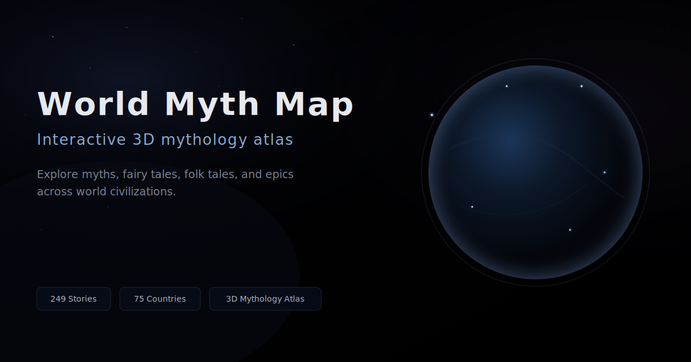

# World Myth Map｜世界神话地图

一个将世界各地神话、童话、民间传说与史诗故事映射到 3D 地球上的互动知识地图。  
An interactive 3D mythology atlas mapping myths, fairy tales, folk tales, and epics across world civilizations.

---

## 在线体验 · Live Demo

**[https://lzwrhys-boop.github.io/world-myth-map/](https://lzwrhys-boop.github.io/world-myth-map/)**

---

## 预览 · Preview



---

## 核心亮点 · Highlights

- **3D 地球神话地图**：Globe.gl 驱动的可探索球面，点位与叙事联动  
- **249** 条世界神话 / 童话 / 民间故事 / 史诗档案  
- **75** 个国家与地区维度呈现  
- **100%** 故事详情补全（侧栏长文与含义字段）  
- **分类图标点位**：图例与底栏分类一致，视觉可读  
- **国家排行榜**：可点击按国家叠加筛选  
- **搜索结果面板**：关键词检索与结果列表  
- **中英文切换**：界面与故事字段双语展示  
- **故事详情展开**：长文阅读与收起  
- **继续探索**：同国 / 同类推荐入口  
- **随机故事**：在筛选条件下快速跳转  
- **可复制故事分享链接**：深链打开指定条目  
- **数据说明与可信度**：独立说明弹窗，标注参考性质  
- **移动端适配**：窄屏布局与触控友好  

---

## 技术栈 · Stack

- HTML  
- CSS  
- JavaScript  
- [Globe.gl](https://github.com/vasturiano/globe.gl)  
- [Three.js](https://threejs.org/)  
- GitHub Pages  

---

## 项目结构 · Structure

```
world-myth-map/
├── index.html
├── style.css
├── script.js
├── data.js
├── details.js
├── assets/
│   └── social-preview.svg
├── README.md
├── PROJECT_HANDOFF.md
└── .nojekyll
```

---

## 数据说明 · Data

本项目中的故事点位基于文化起源地、代表性地区或常见版本进行标注。部分故事存在多个版本、跨文化传播或地点争议；地图面向**文化探索与知识可视化**，不作为严格学术考证结论。

---

## 当前版本 · Status

**Current Version: V2.5**

已完成：

- 基础地图与交互  
- 黑色宇宙视觉系统  
- 故事详情系统（`data.js` + `details.js` 分层）  
- 搜索、筛选、排行榜与图例联动  
- 分享链接与 SEO / 社交预览元信息  
- GitHub Pages 上线  

---

## 后续计划 · Roadmap

- PNG 社交分享图（部分平台对 SVG 预览支持有限）  
- 更细的数据来源与参考文献标注  
- 故事收藏 / 书签  
- 时间线或时代维度筛选  
- 更完整的移动端与无障碍体验  
- 性能优化与代码模块化  

---

## 作者 · Author

**Rhys** / [@lzwrhys-boop](https://github.com/lzwrhys-boop)
